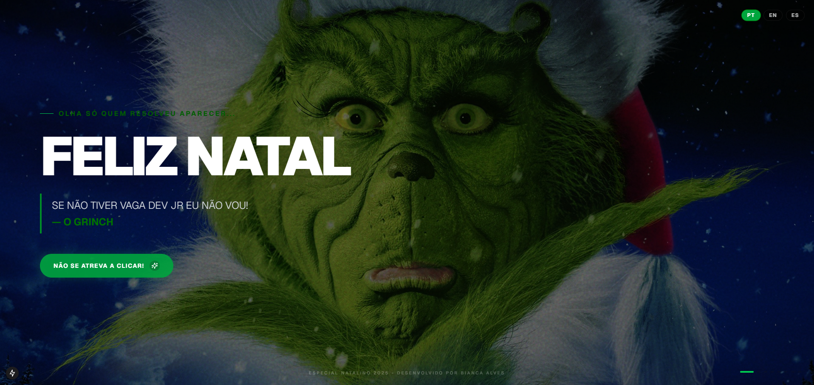

# 🎄 O Natal do Grinch (2025)

> "Adivinha só quem resolveu aparecer na festa?"

Uma página "comemorativa" de Natal, mas do jeito que o Grinch gosta. Este projeto é uma brincadeira divertida para celebrar a data com o personagem mais rabugento dos feriados.



##  Sobre a Brincadeira

Este não é um site de Natal comum com "Ho Ho Ho" e alegria. Aqui, o Grinch tomou conta! O objetivo é arrancar um sorriso (ou uma careta) com mensagens irônicas e uma atmosfera "anti-natalina" divertida.

##  Funcionalidades (Ou "Tranqueiras", segundo o Grinch)

* **Slideshow Cinematográfico:** Imagens do Grinch em tela cheia passando lentamente para criar um clima de drama.
* **Humor Ácido:** Textos e títulos que refletem a personalidade "adorável" do personagem.
* **Multilíngue Rabugento:** Traduções em Português, Inglês e Espanhol, todas adaptadas com o sarcasmo característico dele.
* **Botão "Especial Natalino":** Se tiver coragem de clicar, você ativa uma surpresa com neve caindo e uma música temática.

## Tecnologias

Desenvolvido com:
* Next.js (React)
* TypeScript
* Tailwind CSS (para o estilo sombrio e elegante)

## 🚀 Como Rodar (Se você realmente quiser...)

```bash
# Instale as dependências (o barulho necessário)
npm install

# Rode o projeto (e prepare-se para o drama)
npm run dev